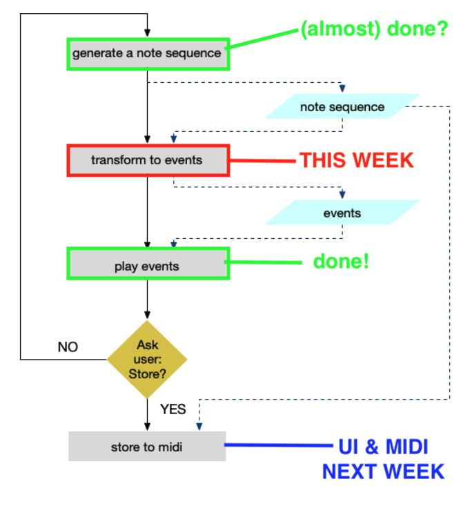

# Session 4

## Repos
See the **git_command_line_overview.md** in main folder regarding the essential git commands.
Also see https://education.github.com/git-cheat-sheet-education.pdf

Number of commits per week should be a lot higher.
_"Collecting commits after 09-15-2025"_   _//15 sep._
```
2x geen repo url per mail ontvangen ...
3x 0
1x 1
1x 3
1x 4
```
Reminder for those who do not use git (often enough) yet; we are using git because of:
- learning to work with version control
- insight in process
  - insights in learning process
  - enable quick code sharing when discussing questions during sessions & trouble shooting
  - provide evidence against plagiarism

Therefore, **git is mandatory --> no git / no proper git workflow --> no final grade**. See "beoordelingscriteria.pdf" in main folder.

NOTE: Do not worry if you still find Git a hurdle. Since working with git is new to many of you, we are bit more forgiving and understanding this first second year course.

## Hoe gaat het? & Hoe is het gegaan met de opdrachten


- Eindopdracht: het omzetten van stappen / pseudo code naar python code _(hierbij alleen even de focus op het generatie deel, voor het andere deel is volgende week tijd)_? Komen jullie hier uit, zijn hier vragen over?


- Hoe is het gegaan met het zelfstandig doornemen en leren werken met functies? Zijn hier nog vragen over? _--> vragen verzamelen voor straks_
- Hoe is het gegaan met de session3/sample_player opdrachten? Zijn hier nog vragen over?
- Hoe is het gegaan met het session3/timestamps_final.py voorbeeld? Hebben jullie kunnen achterhalen hoe het kan dat je maar één sample tegelijkertijd af kunt spelen? Wat is de oplossing hiervoor? _--> dit samen even bekijken?_

## Content
### Functions recap
  - **Example 4a** - this example contains two different structured functions with the same functionality. Namely, one that alters the presented list and the other returns a new list.  
     - [QUESTION] With respect to _readability_, which of the two is clearer when
     applying the functions. E.g.
     ```python
     # the function that alters values in the presented list
     halve_values(values)
     # or the function that returns a new list
     half_note_durations = get_half_values(note_durations)
     ```
     - [QUESTION] Try to come up with some scenarios where each of the two types has benefits.
     E.g. which of the two would you choose when you want to halve the values in a note_durations list and which would you apply if you want to retrieve a time_durations list based on note_durations.
     - [QUESTION] different views exist with respect to these two answer. However, the following is _bad practice_. Why?
     ```python
     retrieve_time_durations(note_durations)
     ```
  - **Example 4b** - in the final assignments we often see the two functions `to_time_dur` and `to_timestamp_seq` combined in one function. Why could hat be considered as _bad practice_?

### Dictionary
  - csd2a/slides/Sessie_4-Events.pdf _@D: for now, skip the other data structures slides_

  - **Example 4c** Demonstrates the usage of a dictionary for an event. By using dictionaries, you can combine the timestamp, reference to a sample, duration and other values in one data structure (a data structure refers to a type of container, like a list, a set, a queue, a dictionary). Using a dictionary for an event instead of a list allows you to retrieve the values by using keys. This improves readability, see the example below.

  ```python
  # an event stored in a list
  event = [1000, "snare", snare, 82, 500]
  # retrieving a value is error prone
  timestamp = event[0]

  # an event stored in a dictionary
  event = {
      "timestamp": 1000,
      "instrumentname": "snare",
      "sample": snare,
      "velocity": 82,
      "duration": 500
  }
  timestamp = event["timestamp"]
  ```
  - **Example 4d** Example demonstrating how to sort a list with dictionaries
  _@D: short in time? skip this!_

  - **Example 4e** Contains an introduction to dictionaries - intended for self-study, **see opdrachten.md**
  - - **Example 4f** Contains an example where a function creates and returns a dictionary  - intended for self-study, **see opdrachten.md**
