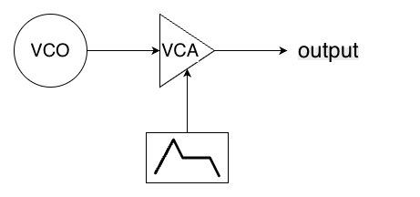
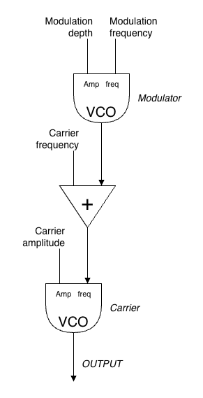

**Voorbeelden en referenties**
- gestandaardiseerde audio diagram elementen:
  

  image from https://econtact.ca/17_4/austin_synthesis.html

- Voorbeeld van een oscillator en een envelope

  
  In pseudo code:

  ```
  oscillatorSample = oscillator.getSample();
  // here envelope is viewed as a signal generator, hence the getSample instead of getValue
  amplitude = envelope.getSample();
  output = oscillatorSample * amplitude;
  ```

- Voorbeeld van FM synthese in een andere audio diagram stijl, ook een geregeld
voorkomende standaard stijl.
  

  In pseudo code is dit bijvoorbeeld:
  ```
  // modDepth and carrierFreq are adaptable parameters of the synth

  // code per sample
  modulationSignal = modulator.getSample() * modDepth;
  carrier.setFreq(modulationSignal + carrierFreq);
  output = carrier.getSample() * carrierAmplitude;

  ```

  Of wanneer je amplitude ziet als 'onderdeel van de oscillator', dan is de pseudo

  ```
  // modDepth and carrierFreq are adaptable parameters of the synth

  // Initialize amplitudes
  modDepth = 100.0f;
  carrierAmplitude = 0.9f;
  modulator.setAmplitude(modDepth);
  carrier.setAmplitude(carrierAmplitude);

  // code per sample
  modulationSignal = modulator.getSample();
  carrier.setFrequency(modulationSignal * carrierFreq);
  output = carrier.getSample();

  ```
