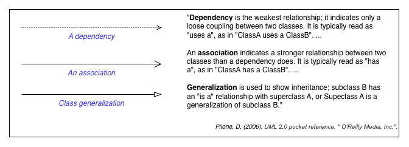
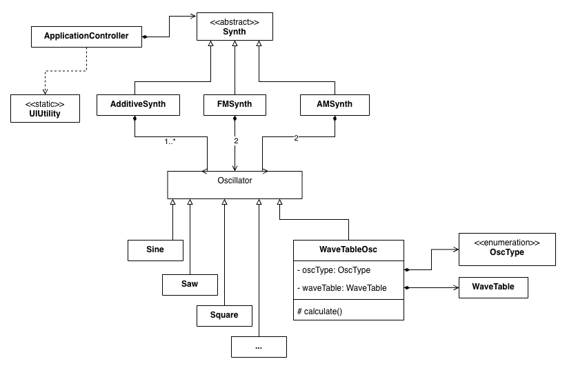

# Session 3 - assignments

## 1. Deliverable - Class diagram eindopdracht
_deadline: session 4_

Stel een class diagram op voor jouw eindopdracht ontwerp. Hanteer UML vormgeving voor has a en is a. Zie onderstaand overzicht, in principe heb je voldoende 'association' en 'class generalization' en eventueel 'dependency' relationships. 

_Voor een overzicht met associatie verder opgesplitst, zie _assignments/3_UML_overview.png._
Zie onderstaand diagram als voorbeeld

## 2. Oefenen (ook al bruikbaar voor de eindopdracht)
2.1 **[WRITE] VOOR SYNTH FOCUS Inheritance - Synth and derived Synth classes**

_DISCLAIMER: Voor het inheritance deel in deze opdracht moet je eerst 2_assigments 
2.3 [WRITE] Inheritance - Oscillator, Sine, Saw and Square hebben uitgevoerd_
- Kopieer je eigen uitwerking van vorige week 2_assigments.md 2.3.
- Voeg een Synth class die gebruik maakt van een aantal oscillator subclasses. Maak bijvoorbeeld. een organ synth met 3 square waves: 1 op grondtoon freq., 1 kwint hierboven en een slightly detuned kwint. _(Deze Synth klinkend en werkend uitwerken voordat je doorgaat.)_ Tip: hanteer dezelfde soort opzet als in de Oscillator classes. 
- Voeg een OrganSynth class toe die erft van Synth en verplaats de specifieke Organ Synth code naar de derived class OrganSynth. Maak van de base class Synth een abstracte class door pure virtual methods te implementeren waar dat kan.
- Voeg nog een eenvoudige derived class toe die erft van Synth, bijvoorbeeld AdditiveSynth die je specifieke ratio's mee kunt geven aan de constructor.    

2.1 **[WRITE] VOOR MELODY FOCUS
- maak een eenvoudige OrganSynth 
- Start aan de MelodyGenerator class die een method heeft die een melody in de vorm van een array teruggeeft

2.2 **[WRITE] Note en Melody class**
- Werk een Note class uit die straks in je eindopdracht te gebruiken om een melody mee af te spelen. Deze Note class bevat i.i.g. properties voor de toonhoogte als MIDI waarde, velocity en duration.
- Bekijk het voorbeeld _assignments/2_melody en voeg een Melody class toe aan je eigen code met een array met Note objecten in plaats van midi waardes als integers. 
- Combineer deze Melody class met je Synth code.

