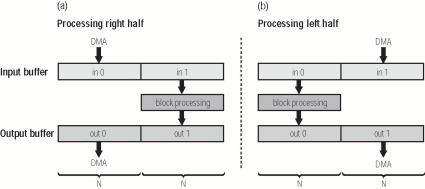

# Session 3

## Hoe gaat het?
- voortgang
- vragen
- repos check - **git is randvoorwaarde**

## Content 
_(maybe in a different order)_

* ### (pure) virtual methods & abstract classes
  * <u>**example: 1_override**</u> 
  * <b>slides - session 3</b>
  * <u>**example: 2_override_callFromBase**</u> --> virtual method
  * <u>**example: 2_override_callFromBase**</u> --> pure virtual method & abstract class
    

* ### oscillators
  <u>**example: 3_sineSquareSaw and 04_sineSquareSawFinal**</u>
    1. let's add Sine as subclass of Oscillator 
    2. add subclass square
    3. add subclass saw --> assignment

* ### callback 
  Audio callback functionality

_source: https://audiodsplab.wordpress.com/ping-pong-buffer-audio-stream/_

* ### class diagram
  Eindopdracht class diagram - kort bespreken - zie _assignments/3_assigments.md

