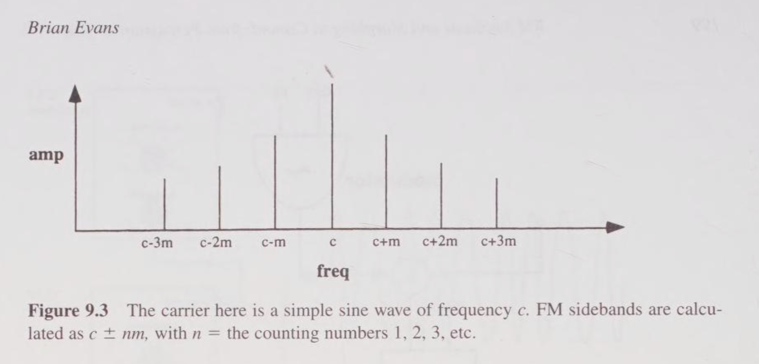
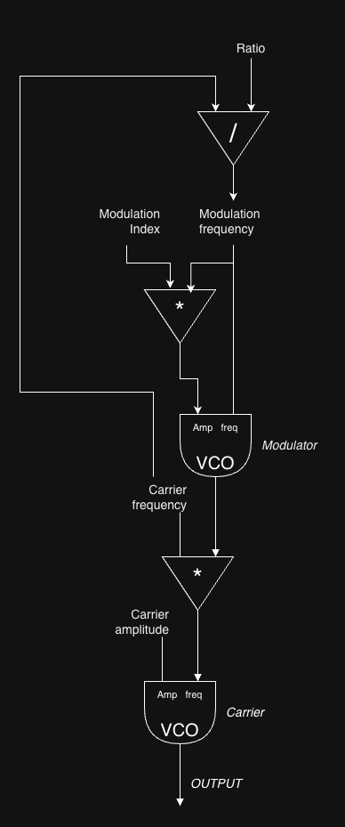

source: Boulanger, 2000, p.199 
Boulanger, R. (Ed.). (2000). The Csound book: perspectives in software synthesis, sound design, signal processing, and programming. MIT press.
You can find this book online, e.g. at: https://archive.org/

Deviation = the amplitude of the modulating signal, controls the modulation width. 

"FM sidebands have frequencies that can be calculated as whole number multiples of the modulating frequency. These are added and subtracted to the frequencies of each partial in the carrier spectrum as illustrated in figure 9.3 " (Boulanger, 2000, p.199 )


(Boulanger, 2000, p.200 )

"The ratio of the carrier frequency to the modulator frequency, commonly called the c/m ratio determines the relative frequencies of the partials in the FM spectrum. When c/m reduces to a simple rational number such as 1/2 or 3/4 the output spectrum is harmonic. When c/m reduces to an irrational number such as 1/ 2 or 2/ 13 partials are in a noninteger relationship and so the spectrum is inharmonic (in practice, complex ratios such as 411/377 or 1/1.617 will create spectra that will sound inharmonic. True irrational numbers can only be approximated digitally anyway)."
(Boulanger, 2000, p.200 )

Thus  c/m ratio 1/2 or e.g. 3/4 is harmonic. 

"The relative amplitudes of the sideband frequencies are depedent on both deviation and frequency of the modulator, so it is convenient to think of these values together as the index of modulation. This modulation index is calculated as the ration ... " 

`modulation index = modulation deviation / modulation frequency`

Where 

`modulation deviation =  the amplitude of the modulating signal`

and `modulation frequency = frequency of the modulation signal` 

"A high index indicates a spectrum rich in partials, while a lower index creates a simpler spectrum."

(Boulanger, 2000, p.200 )


### Calculations

```
ratio = carrier_frequency / modulation_frequency
```

thus

```
modulation_frequency = carrier_frequency / ratio
```

or with multiplication instead of division (where 1 / ratio can be cashed)

```
ratio_inverse = (1 / ratio)`
modulation_frequency =  ratio_inverse * carrier_frequency`
```
Furthermore

```
modulation_index = modulation_deviation / modulation_frequency
```

Thus

```
modulation_deviation = modulation_index * modulation_frequency
```


### Essential calculations 
Given the alteration of carrier frequency and a constant (adaptable as paramter of course) ratio and modulation index 

```
modulation_frequency =  ratio_inverse * carrier_frequency
modulation_deviation = modulation_index * modulation_frequency
```

### Audio flow diagram
